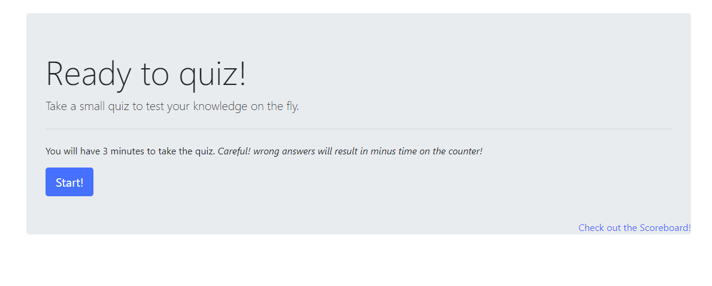
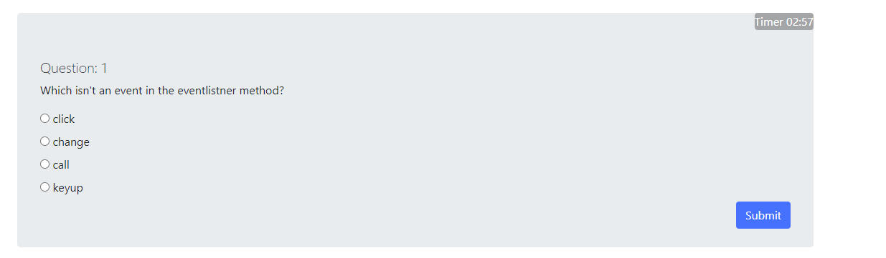

# Timed JS Quiz

The quiz itself contains Javascript questions. There is only a single HTML and CSS file of each. TImed Quiz uses Javascript to dynamically load quiz questions and validate if they are correct or not. This also uses localstorage to store and update scores. Questions are loaded through from a separate array file. When questions are answered incorrectly time is subtracted from the timer. 

## Deployment 
Live page at: [https://beki-g.github.io/timedQuiz/](https://beki-g.github.io/timedQuiz/)

> Screenshot of initial HTML file 

> Screenshot of an empty Scoreboard 

> Screenshot of a question in the quiz with timer counting down 

## Built with
* Bootstrap
* Javascript
* HTML

## Author
Myself, [Beki](https://github.com/Beki-G)